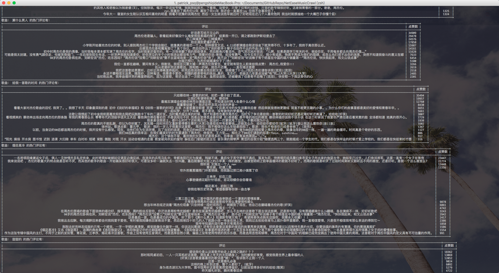

## 网易云音乐新版API爬虫

这是一个爬取 `网易云音乐歌曲评论` 的 `python` 爬虫。

在网易云音乐更新了API之后，现在的API都经过AES和RSA算法加密了，需要携带加密的信息通过POST方式请求。

欢迎大家对我提出意见或者建议，欢迎 fork, star, 和 new issue，有问题可以联系我： `patrick_psq@outlook.com`。

很惭愧，就做了这么一点微小的工作。

---

#### Demo

直接运行`NetEaseMusicCrawl.py`可以得到如下爬取结果：



----

#### 函数列表

`NetEaseMusicCrawl.py` 中实现了3个小爬虫，分别是：

× `get_artist_list`: 爬取热门歌手列表

× `get_song_list`: 爬取某个歌手的热门歌曲列表

× `get_hot_comments`: 爬取某个歌曲的热门评论

× `get_latest_comments`: 爬取某个歌曲的最新评论

各个函数传入的参数可以看函数说明，网易云音乐其他API的爬取方式也都和这三个大同小异，可以通过类似的方式得到。

如果你想爬取某首歌的热门评论，只需要获取到它的id，然后调用 `get_hot_comments` 函数即可。

如果你想爬取某首歌的最新评论，只需要获取到它的id，然后调用 `get_latest_comments` 函数即可。

----

#### 用法说明

1. 该项目运行在 `python 2.7` 环境下，需要安装的第三方库列在 `requirements.txt` 中：

```
requests==2.12.3
beautifulsoup4==4.3.2
pycrypto==2.6.1
prettytable==0.7.2
```
可以通过pip方式安装：

```bash
pip install -r requirements.txt
```

2. 你可以将 `NetEaseMusicCrawl.py` 文件copy到你的目录下，然后通过以下两种方式使用：

```python
# Method 1

import NetEaseMusicCrawl

artist_list = NetEaseMusicCrawl.get_artist_list(100)

# Method 2

from NetEaseMusicCrawl import get_artist_list

artist_list = get_artist_list(100)

```

----

#### API说明

1. 爬取热门歌手列表(get_artist_list)

```python
def get_artist_list(limit=60, offset=0):
    """
    返回前limit个热门歌手的所有信息，名字在name字段，id在id字段。

    :param limit: 前limit个热门歌手
    :param offset: 从第offset个歌手开始
    :return: 一个list，每个元素是一个字典，包含一位歌手的所有信息，其中名字在name字段，id在id字段
    """
```

使用样例：

```bash
>>> import NetEaseMusicCrawl
>>> NetEaseMusicCrawl.get_artist_list(1,1)
[{u'img1v1Url': u'http://p4.music.126.net/6xgsfT2ZLjdgzbwO4UiGwA==/3285340746016446.jpg', u'name': u'\u9648\u5955\u8fc5', u'briefDesc': u'', u'albumSize': 90, u'img1v1Id': 3285340746016446, u'musicSize': 1535, u'alias': [u'Eason Chan'], u'picId': 3287539769315193, u'picUrl': u'http://p4.music.126.net/XZrSQeNpsfjyRmibubCb9Q==/3287539769315193.jpg', u'id': 2116, u'trans': u'', u'topicPerson': 0}]
```

2. 爬取某个歌手的热门歌曲列表(get_song_list)
```python
def get_song_list(artist_id, limit=50):
    """
    输入歌手id，返回该歌手的前limit(默认值为50)首热门歌曲。

    :param artist_id: 歌手id
    :param limit: 前limit首热门歌曲
    :return: 返回一个list，每个元素的第一项是歌曲名，第二项是歌曲id(以字符串的形式呈现)
    例如： [(u'\u544a\u767d\u6c14\u7403', u'/song?id=418603077'), ...]
    """
```

使用样例：

```bash
>>> import NetEaseMusicCrawl
>>> NetEaseMusicCrawl.get_song_list(2116, limit=3)
[(u'\u966a\u4f60\u5ea6\u8fc7\u6f2b\u957f\u5c81\u6708', u'/song?id=35403523'), (u'\u4e0d\u8981\u8bf4\u8bdd', u'/song?id=25906124'), (u'\u7ea2\u73ab\u7470', u'/song?id=65126')]
```

3. 爬取某个歌曲的热门评论(get_hot_comments)
```python
def get_hot_comments(song_id, threshold=COMMENT_THRESHOLD):
    """
    输入歌曲id，返回该歌曲的前threshold个热门评论。

    :param song_id: 歌曲id，string类型和int类型均可，例如35403523
    :param threshold: 前threshold个热门评论
    :return: 返回一个list，每个子元素也是list，其中第一项为评论内容，第二项为点赞数。
    例如： [[u'\u4e24\u5929\u524d \u9648\u5955\u8fc5\u5728\u58a8\u5c14\u672c\u5f00\u6f14\u5531\u4f1a \u5b89\u4e1c\u5c3c\u53d1\u5fae\u535a\u8bf4\u4ed6\u5728\u53f0\u4e0b\u542c\u7684\u611f\u6168\u4e07\u5206 \u5c31\u50cf\u505a\u4e86\u4e00\u573a\u68a6 \u4ed6\u7ec8\u4e8e\u5b8c\u6210\u4e86\u81ea\u5df1\u7684\u68a6 \u81ea\u5df1\u559c\u6b22\u7684\u6b4c\u624b\u4e3a\u4ed6\u7684\u4e66\u5531\u7684\u4e3b\u9898\u66f2 \u4f60\u6709\u68a6\u60f3\u4f60\u5c31\u8981\u634d\u536b\u5b83~', 64520],...]
    """
```

使用样例：

```bash
>>> import NetEaseMusicCrawl
>>> NetEaseMusicCrawl.get_hot_comments(35403523, threshold=2)
[[u'\u4e24\u5929\u524d \u9648\u5955\u8fc5\u5728\u58a8\u5c14\u672c\u5f00\u6f14\u5531\u4f1a \u5b89\u4e1c\u5c3c\u53d1\u5fae\u535a\u8bf4\u4ed6\u5728\u53f0\u4e0b\u542c\u7684\u611f\u6168\u4e07\u5206 \u5c31\u50cf\u505a\u4e86\u4e00\u573a\u68a6 \u4ed6\u7ec8\u4e8e\u5b8c\u6210\u4e86\u81ea\u5df1\u7684\u68a6 \u81ea\u5df1\u559c\u6b22\u7684\u6b4c\u624b\u4e3a\u4ed6\u7684\u4e66\u5531\u7684\u4e3b\u9898\u66f2 \u4f60\u6709\u68a6\u60f3\u4f60\u5c31\u8981\u634d\u536b\u5b83~', 64520], [u'\u6211\u4eec\u7528\u521d\u4e2d\u4e09\u5e74\u53bb\u76fc\u671b\u9ad8\u4e2d\u4e09\u5e74\uff0c\u6211\u4eec\u7528\u9ad8\u4e2d\u4e09\u5e74\u53bb\u61a7\u61ac\u5927\u5b66\u56db\u5e74\uff0c\u800c\u7528\u5927\u5b66\u56db\u5e74\u53bb\u6000\u5ff5\u4e2d\u5b66\u516d\u5e74\uff0c\u6700\u7ec8\u7528\u6211\u4eec\u7684\u4e00\u751f\u53bb\u796d\u5960\u6211\u4eec\u7684\u9752\u6625\u3002 \u5927\u5b78\u5373\u5c06\u7ed3\u675f\u8c01\u4f1a\u966a\u6211\u8d70\u4e0b\u4e00\u6bb5[\u7231\u5fc3][\u7231\u5fc3]', 60442]]
```

4. 爬取某个歌曲的最新评论(get_latest_comments)
```python
def get_latest_comments(song_id, threshold=COMMENT_THRESHOLD):
    """
    输入歌曲id，返回该歌曲的前threshold个最新评论。

    :param song_id: 歌曲id，string类型和int类型均可，例如35403523
    :param threshold: 前threshold个最新评论
    :return: 返回一个list，每个子元素也是list，其中第一项为评论内容，第二项为点赞数。
    例如： [[u'\u4e5f\u8bb8\u4f1a\u53d8\u6210\u611f\u52a8', 1], [u'\u53d8\u6210\u52c7\u6562', 0]]
    """
```

使用样例：

```bash
>>> import NetEaseMusicCrawl
>>> NetEaseMusicCrawl.get_latest_comments(35403523, threshold=2)
[[u'\u4e5f\u8bb8\u4f1a\u53d8\u6210\u611f\u52a8', 1], [u'\u53d8\u6210\u52c7\u6562', 0]]
```
----

#### 待做

没有实现评论的翻页功能，目前每首歌只能爬取15条热门评论和20条最新评论。

有兴趣的朋友可以自己做做看...
